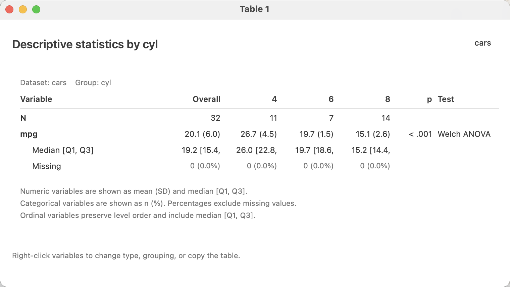
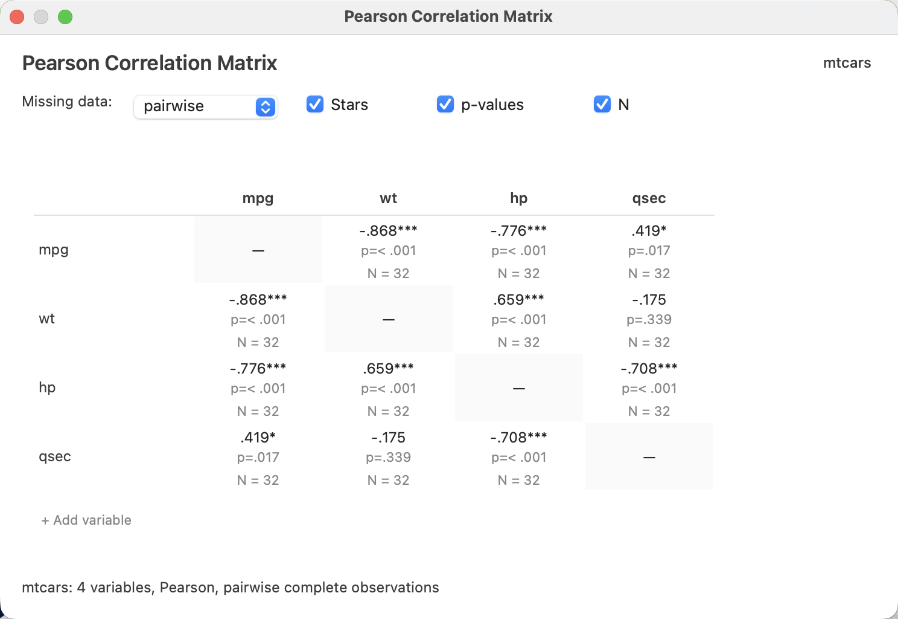
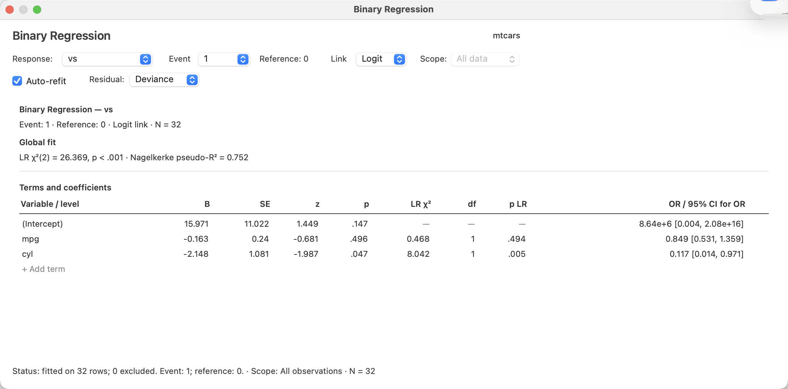

Analyze menu · window gallery

# Analysis windows

The window captures on this page come from LinkEDA. The command names match the
public **Analyze** menu in release `v0.0.113R`.

## Descriptives

::: {.analysis-window}

<h3>Table 1</h3>
Table 1…Descriptive statistics from a plot

:::

::: {.analysis-window}

<h3>Pearson Correlation Matrix</h3>
Correlation Matrix…

:::

::: {.menu-family}
<strong>Other commands in Descriptives</strong>

Contingency Table…Principal Components / Factor Analysis…Quick Cluster…

:::

## Test

::: {.menu-family}
<strong>Commands in Test</strong>

One-Sample Tests…Two-Sample Tests…Paired-Samples Tests…One-Way ANOVA…

:::

## Modeling

::: {.analysis-window}

<h3>Binary Regression</h3>
Binary › Fit Model…Logit linkR fit

:::

::: {.menu-family}
<strong>Model families in the public menu</strong>

LinearBinaryCountPositive ContinuousProportion

Each family provides <strong>Fit Model…</strong> and <strong>Compare Models…</strong>.

:::

## Additional analysis

::: {.menu-family}

Scale Analysis…

:::
