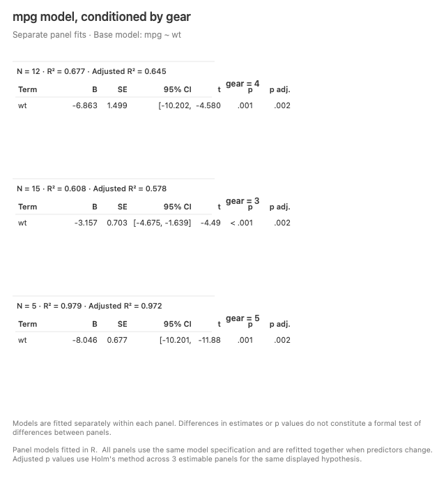
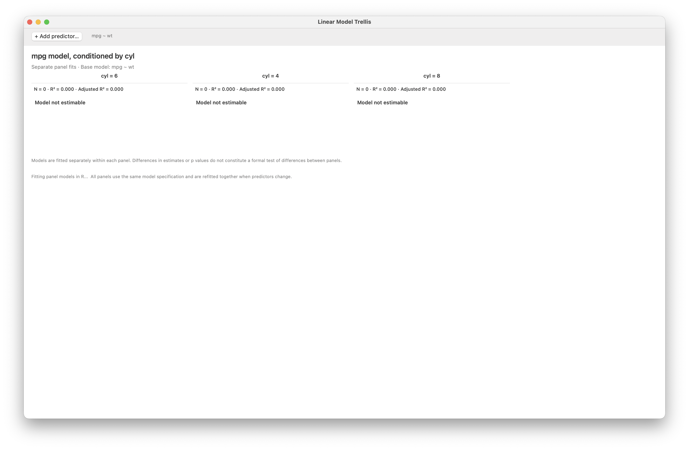

Analyze menu · window gallery

# Analysis windows

All images on this page are real LinkEDA windows or real LinkEDA result views. No substitute statistical graphics are used here.

## Descriptives

::: {.analysis-window}

<h3>Table 1</h3>
Table 1…Descriptive statistics from a plot

:::

::: {.analysis-window}

<h3>Pearson Correlation Matrix</h3>
Correlation Matrix…

:::

::: {.menu-family}
<strong>Other commands in Descriptives</strong>

Contingency Table…Principal Components / Factor Analysis…Quick Cluster…

:::

## Test

::: {.analysis-window .result-detail}

<h3>Inferential result table</h3>
One-Sample t Test…Independent-Samples t Test…Paired-Samples t Test…One-Way ANOVA…

:::

## Regression

::: {.analysis-window}

<h3>Binary Regression</h3>
Binary Regression…Logit linkR fit

:::

::: {.analysis-window .wide-window}

<h3>Linear Model Trellis</h3>
Linear Model Trellis…Add predictor to every panel

:::

::: {.menu-family}
<strong>Other commands in Regression</strong>

Linear Model…Compare Linear Models…Compare Binary Regression Models…Generalized Linear Model…Compare Generalized Linear Models…

:::

## Mixed Models

::: {.menu-family .experimental-family}
<strong>Experimental windows</strong>

Linear Mixed Model…Generalized Linear Mixed Model…

:::
