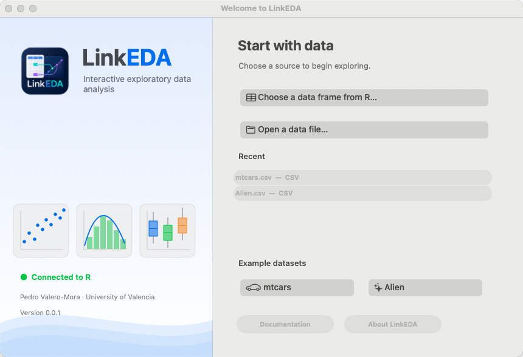
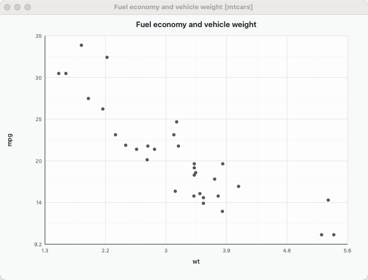

::::: {.hero}
:::: {.hero-copy}

Linked exploratory data analysis

# See a case once. Follow it everywhere.

LinkEDA is a native macOS application for exploratory data analysis. Data sheets, interactive plots and statistical analyses remain connected while R performs the statistical computation.

::: {.hero-actions}
[Download the experimental build](getting-started.qmd#download){.button .button-primary}
[Explore the plots](plots.qmd){.button .button-quiet}
:::

Experimental software by Pedro Valero-Mora, Universitat de València.

::::

:::: {.hero-visual}

::::
:::::

::: {.experimental-banner}
**Experimental preview.** LinkEDA is under active development. Its interface, analyses, file formats and R integration may change substantially in future versions. Do not rely on the current build for unattended or production-critical work.
:::

::: {.section-intro}
## Exploration as a connected activity

A row selected in one view is the same observation everywhere else. LinkEDA preserves that identity across compatible plots and the data sheet, making it possible to move from a pattern to the cases behind it and then to a statistical summary.
:::

:::: {.feature-grid}
::: {.feature-card}

01

### Inspect

Import a supported file or pass a data frame from R. Inspect values and variable metadata in a native data sheet.
:::

::: {.feature-card}

02

### Link

Select or brush observations in a plot. Other linked views update using the shared row identities rather than a separate copy of the data.
:::

::: {.feature-card}

03

### Analyse

Move from descriptive summaries and tests to regression, generalized and mixed models. Statistical fitting is delegated to R.
:::
::::

:::: {.showcase-two}
::: {.showcase-copy}

A real application window

## Start with a file, an R object or an example

The Welcome Window is the entry point when LinkEDA starts without a data set. It can open a supported file, list suitable objects from the connected R session, or load the included `mtcars` and Alien examples.

[Installation and first launch](getting-started.qmd)
:::

::: {.showcase-image}

:::
::::

:::: {.showcase-two .reverse}
::: {.showcase-image}

:::

::: {.showcase-copy}

Native, direct and contextual

## The graph is the interface

Plot menus expose selection, analysis, export and display actions in context. Variable names and conditioning strips can also act as controls in plots that support replacement.

[See every implemented plot](plots.qmd)
:::
::::

::: {.project-credit}
### Project

LinkEDA is authored by **Pedro Valero-Mora** at the **Universitat de València**. The public interface is called LinkEDA; some source-code and repository identifiers retain earlier technical names for compatibility.
:::
