
Plot menu · visual reference

# Plot examples

The native captures show LinkEDA itself. The remaining examples were generated reproducibly in R from `mtcars` or `airquality`, using the variables and panel structures accepted by the corresponding LinkEDA plot.

## Main plots

:::: {.visual-gallery}
::: {.visual-card .featured}

<h3>Scatterplot…</h3>Native capture · `mtcars`: `mpg` × `wt`

:::

::: {.visual-card}
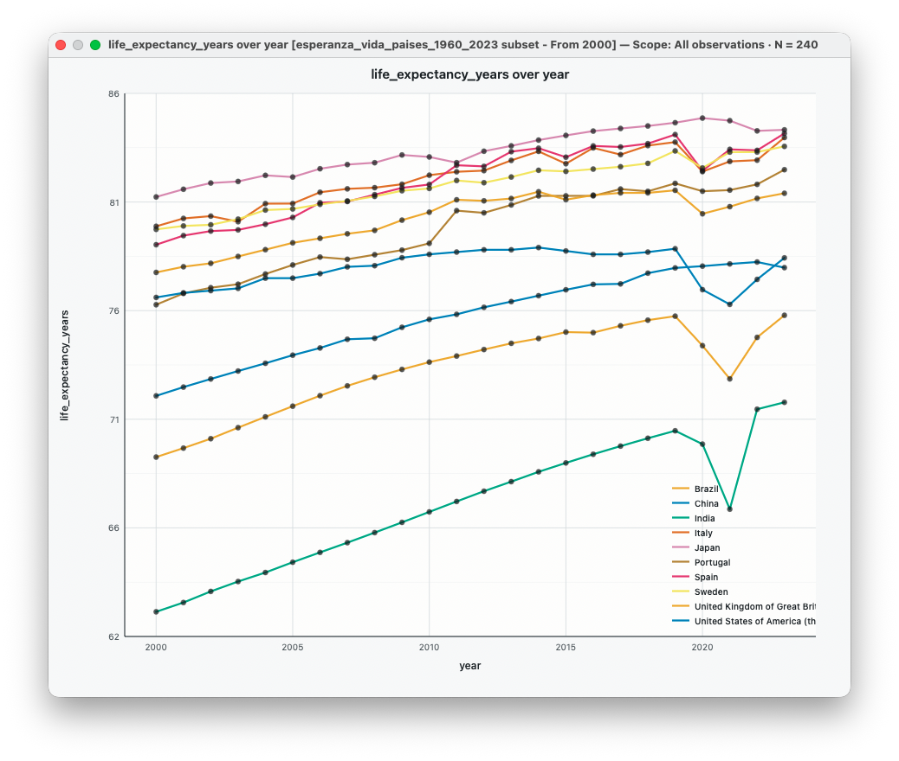

<h3>Time Series…</h3>R example · `airquality`: `Day`, `Temp`, series `Month`

:::

::: {.visual-card}
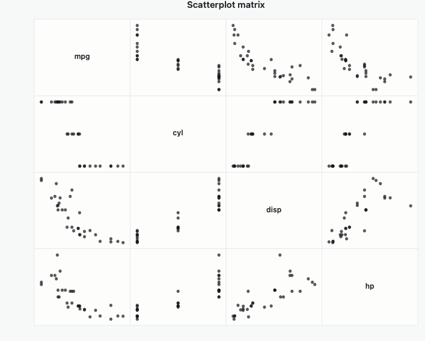

<h3>Scatterplot Matrix…</h3>R example · `mtcars`: `mpg`, `wt`, `hp`, `qsec`

:::

::: {.visual-card}
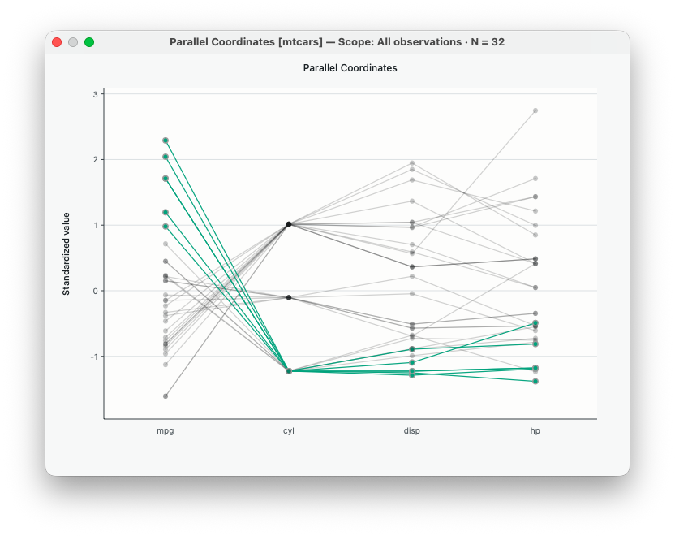

<h3>Parallel Coordinates…</h3>R example · six standardized `mtcars` variables

:::

::: {.visual-card .featured}
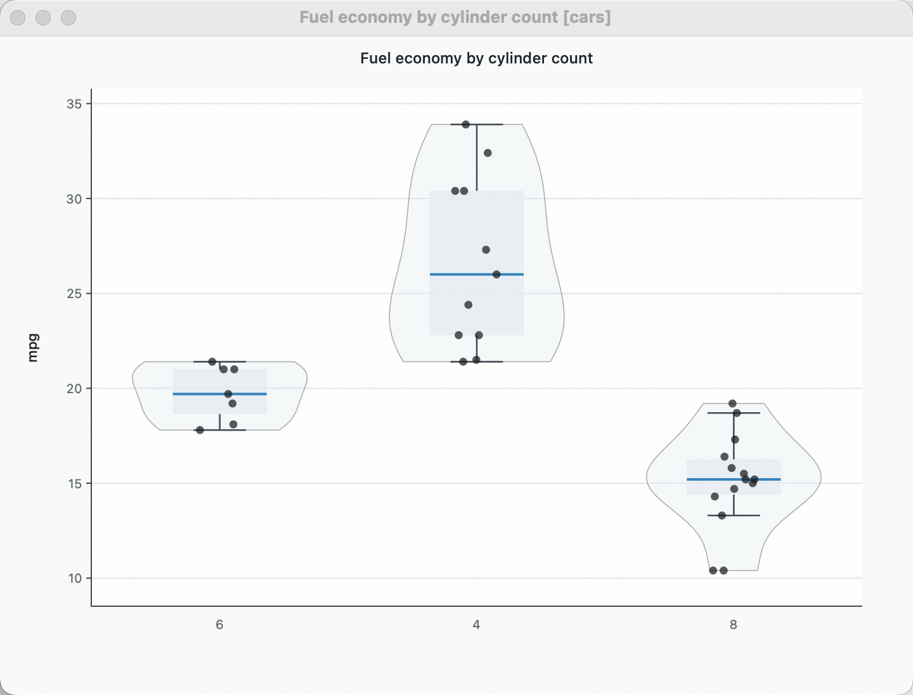

<h3>Boxplot…</h3>Native capture · `mtcars`: `mpg` by `cyl`

:::

::: {.visual-card}
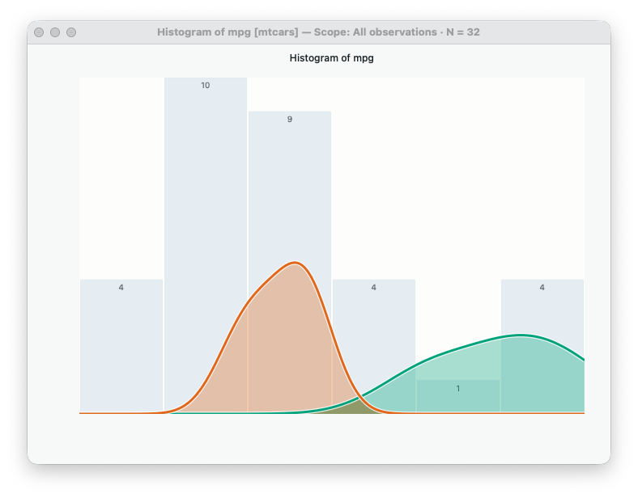

<h3>Histogram…</h3>R example · `mtcars`: `mpg`

:::

::: {.visual-card}
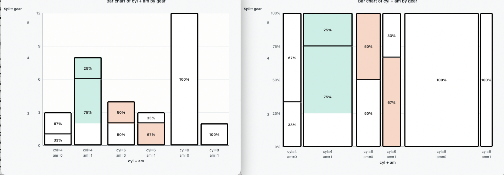

<h3>Bar Chart…</h3>R example · `mtcars`: `cyl`

:::
::::

## Trellis Plots

:::: {.visual-gallery .trellis-gallery}
::: {.visual-card .wide}
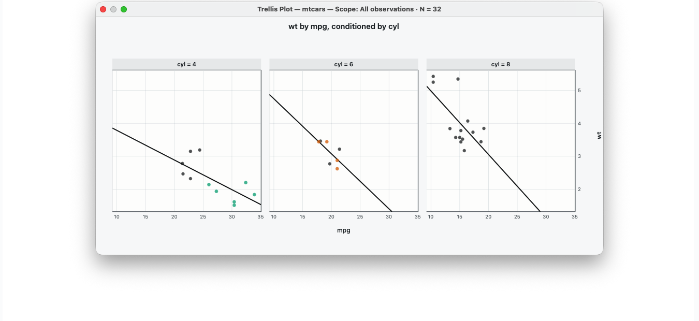

<h3>Scatterplot…</h3>`mpg` × `wt` · conditioned by `cyl`

:::

::: {.visual-card .wide}
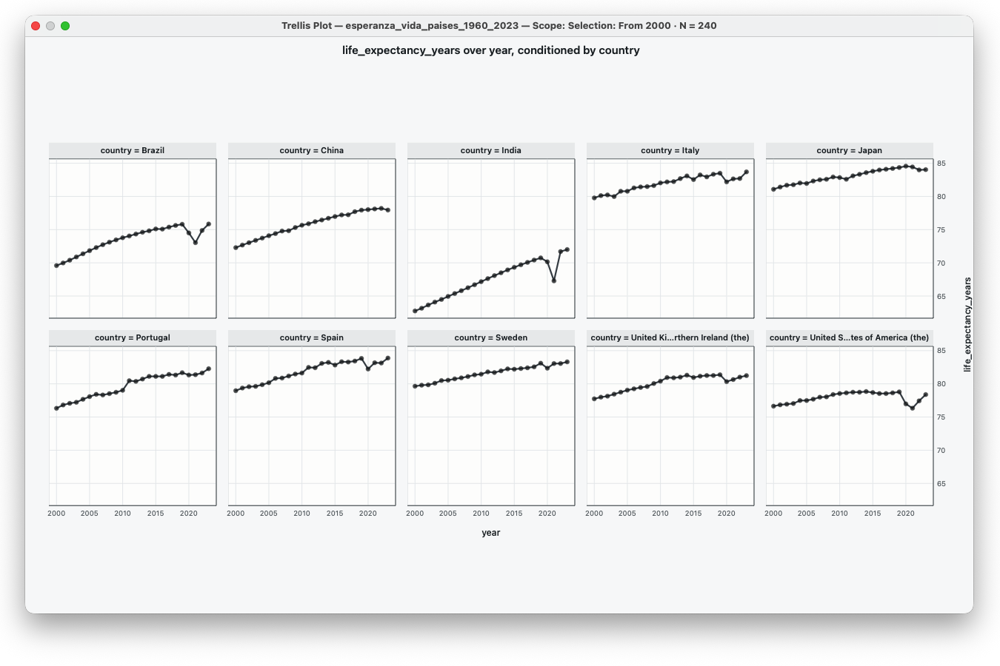

<h3>Time Series…</h3>`Temp` over `Day` · conditioned by `Month`

:::

::: {.visual-card}
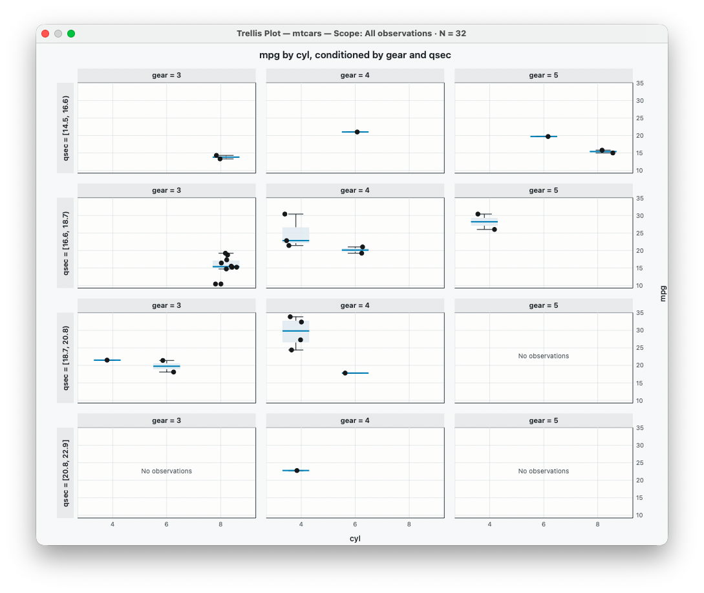

<h3>Boxplot…</h3>`mpg` by `cyl` · conditioned by `am`

:::

::: {.visual-card}
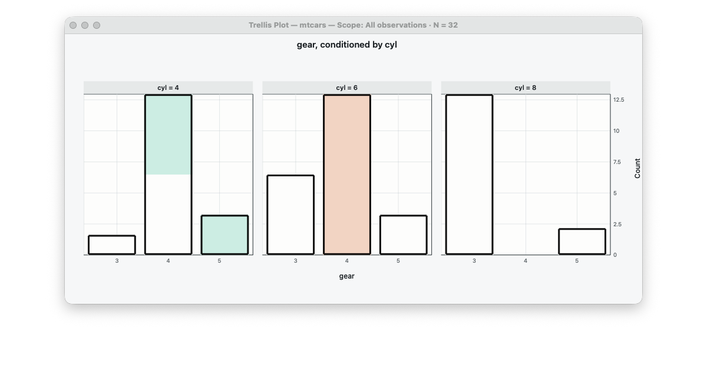

<h3>Bar Chart…</h3>`cyl` counts · conditioned by `am`

:::

::: {.visual-card .wide}
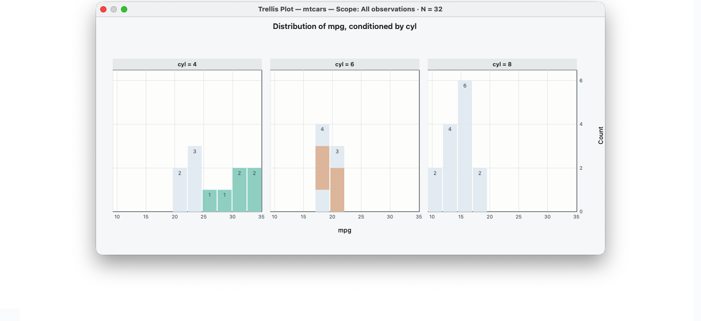

<h3>Histogram…</h3>`mpg` · conditioned by `cyl`

:::
::::

## Interactive demonstrations

:::: {.demo-gallery}
::: {.demo-card .demo-wide}
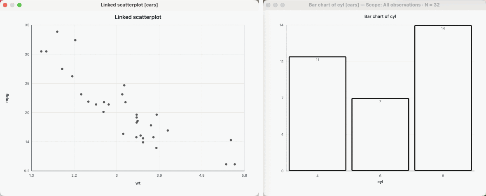

<h3>Selection across linked plots</h3>Select a bar → the same cases light up in the scatterplot

:::

::: {.demo-card}
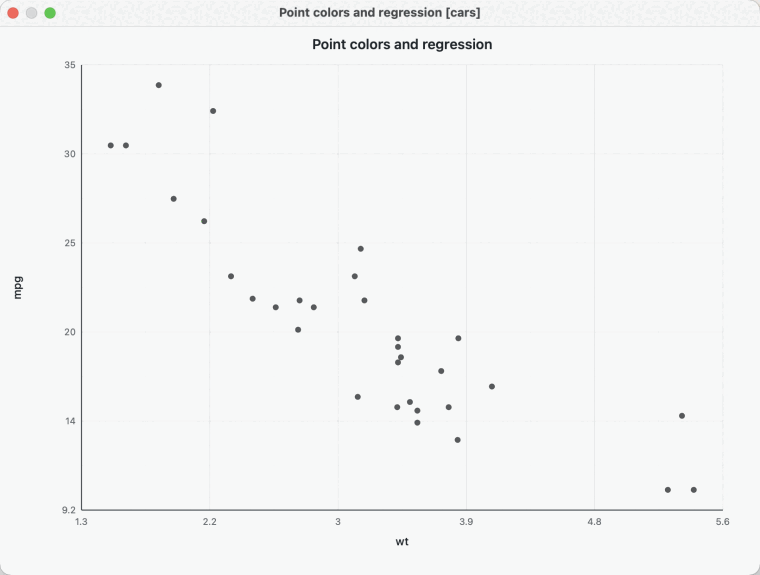

<h3>Point colors and regressions</h3>Color selected points → regression by point color

:::

::: {.demo-card}
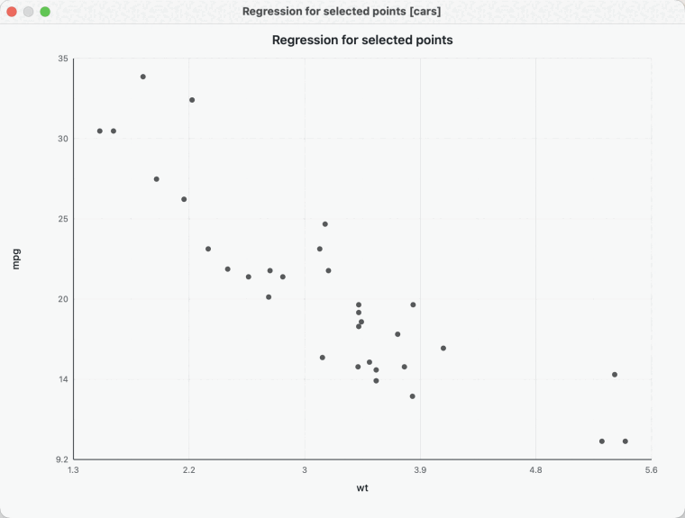

<h3>Regression for selected points</h3>Change the selection → the fitted line updates

:::

::: {.demo-card .demo-wide}
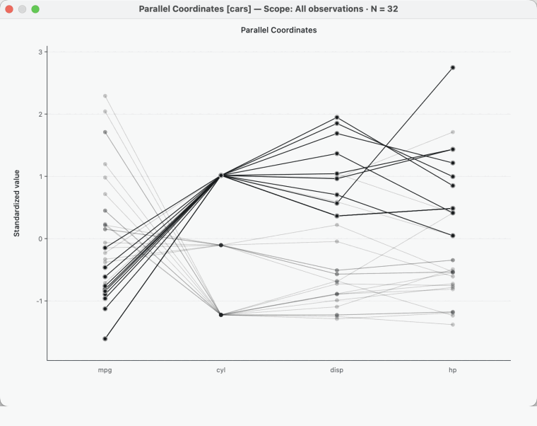

<h3>Change a parallel-coordinate variable</h3>Click `cyl` → Replace Variable → `qsec`

:::
::::

## Context menu to analysis

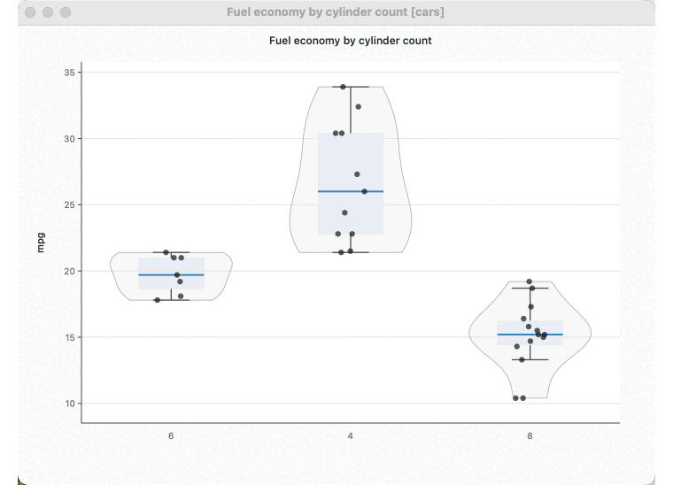

::: {.visual-note}
Right-click → **Analyze This Boxplot** → **Descriptive statistics** → native **Table 1** window.
:::

## Linked selection

:::: {.selection-strip}
::: {.selection-step}
1<strong>Select a point, row or aggregate mark</strong>
:::
::: {.selection-arrow aria-hidden="true"}
→
:::
::: {.selection-step}
2<strong>LinkEDA retains the original row identities</strong>
:::
::: {.selection-arrow aria-hidden="true"}
→
:::
::: {.selection-step}
3<strong>Every linked view redraws the same cases</strong>
:::
::::

[See the linked-selection model](linked-eda.qmd#selection-across-views).
